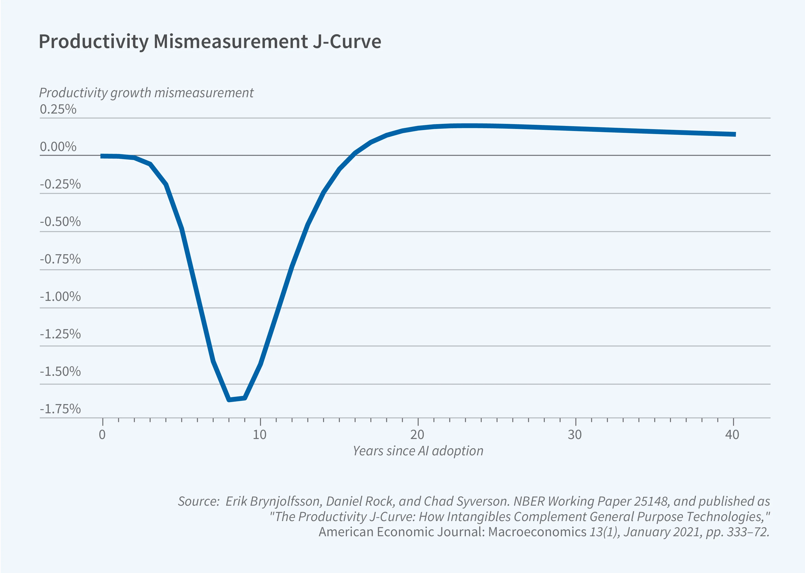

+++
title = "Le fantôme de Solow : pourquoi l'IA ne booste (pas encore) la productivité"
type = "post"
date = '2026-07-27T04:03:07+01:00'
categories = ["Article"]
tags = ["AI","productivity","economy"]
draft = true
+++

En 1993, "The Productivity Paradox of IT"[^1] soulignait les faibles gains de productivité observés malgré l’essor de l’informatique, alors présentée comme une révolution industrielle majeure.

Ce paradoxe a été énoncé simplement par le prix Nobel d'économie Robert Solow : "On voit l'ère informatique partout, sauf dans les statistiques de productivité."

## Paradoxe de Solow et IA

"Pourquoi voit-on l'IA partout, sauf dans les statistiques de productivité ?"

Car s'il est indéniable pour beaucoup (et j'en fais partie) que l'IA apporte un gain de productivité personnelle, l'évaluation factuelle globale présente une réalité plus mitigée :

- [Une étude de la Banque fédérale de réserve d’Atlanta](https://www.atlantafed.org/research-and-data/publications/working-papers/2026/03/24/03-firm-data-on-ai) de 2026 portant sur 6 000 dirigeants à travers le monde : 80% des entreprises indiquent que l'IA n'a pas eu d'effet sur l'emploi ou la productivité ces trois dernières années. Elles continuent pourtant d’anticiper des gains significatifs dans les trois prochaines années.
- [PwC Global CEO Survey 2026](https://www.pwc.com/gx/en/news-room/press-releases/2026/pwc-2026-global-ceo-survey.html) : sur 4 454 dirigeants dans 95 pays, 56% ne constatent encore aucun bénéfice financier significatif lié à l’IA. Seuls 12% déclarent simultanément une réduction des coûts et une augmentation des revenus.

D’autres études observent pourtant déjà des gains significatifs chez les entreprises utilisatrices. Une [étude de la Banque européenne d’investissement](https://cepr.org/voxeu/columns/how-ai-affecting-productivity-and-jobs-europe) estime notamment une amélioration moyenne de 4% de la productivité du travail. Le paradoxe ne tient donc peut-être pas à l’absence de gains, mais à leur concentration et à leur faible diffusion.

## La productivité, un indicateur imparfait

La productivité d’un individu n’est pas celle d’une équipe. Celle d’une équipe ne se traduit pas nécessairement par une amélioration des résultats de l’entreprise. Et ces gains locaux peuvent rester invisibles dans les indicateurs macroéconomiques utilisés par les économistes.

Il faut également distinguer productivité et retour sur investissement. Les deux notions sont liées, mais elles ne sont pas interchangeables. Une technologie peut améliorer la vitesse, la qualité, la capacité d’innovation ou les conditions de travail sans produire immédiatement un retour financier mesurable. Inversement, un investissement peut être rentable sans augmenter directement la quantité produite par heure travaillée.

**Les gains existent déjà localement, mais ils restent peu visibles globalement parce qu’ils exigent une transformation organisationnelle, sont imparfaitement mesurés et sont en partie réinvestis dans une production supplémentaire.**

## Un paradoxe lié à des causes intemporelles

### Gains non réalisés : le délai d'apprentissage et de diffusion

Comme l’électricité ou l’informatique, une technologie générale ne produit pas ses principaux gains par sa seule installation. Elle demande de nouvelles compétences, des investissements complémentaires et une réorganisation des processus.

La courbe de productivité associée a été nommée "Courbe de productivité en J" par Erik Brynjolfsson, Daniel Rock et Chad Syverson.

Elle caractérise un investissement initial important suivi d’une période de stagnation ou même de baisse de productivité mesurée, avant une forte accélération une fois que les complémentarités (investissements intangibles, nouvelles compétences, réorganisation organisationnelle) sont en place. 

###  Gains mal mesurés

Les délais de diffusion expliquent pourquoi les gains tardent à apparaître. Mais ils n’expliquent pas pourquoi certains utilisateurs déclarent déjà gagner du temps sans que les mesures objectives le confirment. Une seconde difficulté tient donc à la mesure elle-même.

#### Les erreurs de mesure 

Les outils statistiques traditionnels comme le PIB et la productivité du travail (production par heure travaillée) ont été conçus pour une économie industrielle du XXe siècle, où la production était majoritairement tangible (voitures, acier, biens de consommation). Ils peinent aujourd’hui à capturer les gains pourtant réels apportés par l’IA.

C'est d'ailleurs ce que souligne l’OCDE dans [un rapport](https://www.oecd.org/en/publications/oecd-compendium-of-productivity-indicators-2025_b024d9e1-en/full-report/productivity-in-a-shifting-geopolitical-and-economic-landscape_7b0e7702.html) : l’IA amplifie des problèmes de mesure déjà anciens. Les statistiques capturent mal la production intangible, l’amélioration qualitative des services et une partie de la production du secteur public.

#### L'écart de perception   

Comme pour l'ordinateur en son temps, l'effet de nouveauté pousse l'utilisateur à surévaluer sa productivité avec le nouvel outil qu'est l'IA. En masquant les limites de leur usage, cette perception peut freiner leur progression.

C'est ce que semblent confirmer les études :
- [METR de 2025](https://blog.vibecoder.me/what-metr-study-found-about-ai-coding-productivity) montrait un ralentissement de 19% chez des développeurs open source expérimentés, malgré leur perception inverse. Mais METR estime désormais que ce résultat ne doit pas être extrapolé aux outils de 2026 et ne parvient plus à mesurer proprement leur effet en raison de biais de sélection croissants.
- [Gitclear 2024](https://arc.dev/talent-blog/impact-of-ai-on-code/) qui montre un bond du code churn (code jeté ou réécrit) et de la duplication du code produit avec de l'IA. Cette tendance est de plus en plus présente de nos jours et souvent désignée par le terme "[AI slop](https://simonwillison.net/2024/May/8/slop/)".

L’exemple de Meta est presque un cas d’école : [Mark Zuckerberg a reconnu](https://www.reuters.com/business/zuckerberg-says-ai-agent-development-going-slower-than-expected-2026-07-02/) que l’entreprise avait été "super optimiste" concernant des outils comme Claude Code et que le développement agentique n’avait pas accéléré comme prévu, malgré des investissements considérables dans les infrastructures d’IA.

### Des gains concentrés et difficiles à interpréter

Les effets économiques de l’IA sont très hétérogènes. Certaines entreprises, certains métiers et certaines tâches peuvent déjà enregistrer des gains importants, tandis que d’autres n’en tirent encore aucun bénéfice mesurable. Cette concentration peut rendre les gains difficiles à observer dans les statistiques globales : une forte amélioration chez quelques acteurs est diluée par une adoption encore superficielle ou inefficace dans le reste de l’économie.

Les performances financières des fournisseurs d’IA montrent où se concentre une partie de la valeur, mais ne mesurent ni les gains de productivité de leurs clients ni ceux des fournisseurs eux-mêmes.

### Des gains absorbés : le paradoxe de Jevons appliqué au travail intellectuel

Au XIXe siècle, l’économiste William Jevons constatait que l’amélioration de l’efficacité des machines à charbon ne réduisait pas la consommation totale de charbon. En diminuant le coût d’utilisation de cette ressource, elle multipliait au contraire ses usages et augmentait la demande globale.

Un mécanisme similaire semble apparaître avec l’IA. En réduisant fortement le coût de production d’un texte, d’un logiciel, d’une analyse ou d’une image, elle ne conduit pas nécessairement à produire la même chose en moins de temps. Elle incite plutôt à produire davantage, sans forcément ajouter de la valeur : plus de contenus, plus de variantes, plus de fonctionnalités et plus d’itérations.

À cette production supplémentaire s’ajoutent de nouvelles tâches de sélection, de vérification, de correction et de maintenance. Le gain d’efficacité dans la génération est alors bien réel, mais il peut être partiellement absorbé par ces coûts induits et par la faible valeur marginale d’une partie de ce qui est produit.

L’IA ne supprime donc pas nécessairement le travail; elle déplace la limite de ce qu’il devient possible, et bientôt attendu, de produire.

L’ "[AI slop](https://arxiv.org/abs/2603.27249)" en est une conséquence visible : lorsque le coût de génération devient presque nul, la quantité produite peut croître bien plus vite que sa valeur. 

## Les limitations propres à l'IA

### De producteur à superviseur : la taxe d'évaluation

Dans l'IT traditionnel, l'humain reste le producteur principal assisté par un outil déterministe (un compilateur, un tableur). L'IA générative déplace une partie de cette charge cognitive :

L’utilisateur passe d’un rôle de producteur principal à celui de superviseur, chargé de guider, vérifier et corriger la production de l’IA. Relire du code ou du texte généré pour y traquer des hallucinations, des bugs subtils ou des contresens contextuels s'avère cognitivement éprouvant.

Le gain attendu peut alors être fortement réduit, voire entièrement absorbé par le temps de vérification : générer plusieurs centaines de lignes de code prend quelques secondes, mais valider que l'architecture est adaptée et le code est correct peut annuler une grande partie du gain, voire, dans certains cas, prendre davantage de temps qu’une conception directe.

Une [étude longitudinale de Vella et Blincoe, 2026](https://arxiv.org/abs/2605.23135) vient préciser ce constat.

Les développeurs interrogés y déclarent passer moins de temps à produire du code, mais davantage à diriger, vérifier et corriger les productions de l’IA. Les chercheuses proposent le terme supervisory engineering work. Dans la cohorte suivie, 84% continuent de percevoir un gain de productivité, tandis que la proportion signalant une dégradation d’au moins une dimension de leur expérience de travail passe de 14% à 27%, notamment concernant la charge cognitive et l’état de flow.

### Des coûts d’exécution et d’intégration encore élevés

Dans un [rapport publié par Goldman Sachs en 2024](https://www.goldmansachs.com/images/migrated/insights/pages/gs-research/gen-ai--too-much-spend%2C-too-little-benefit-/TOM_AI%202.0_ForRedaction.pdf), Jim Covello soulignait un point particulièrement intéressant : remplacer des emplois faiblement rémunérés par une technologie extrêmement coûteuse constitue presque l’inverse des précédentes transitions technologiques.

On pourrait s'attendre à ce que ce coût de l'IA se soit amenuisé depuis, mais si le coût unitaire d’accès à une capacité donnée décroît rapidement, le coût total des infrastructures de pointe et de l’intégration organisationnelle peut continuer à augmenter.

Comme pour les technologies précédentes, ces coûts devraient diminuer. Pour l’instant, ils freinent encore l’adoption généralisée de l’IA.

## Conclusion

Certains trouveront peut-être dans cette analyse une vision pessimiste de l’IA, voire une justification de leur position anti-IA.

J’y vois au contraire un constat encourageant. Une grande partie des difficultés actuelles : délai d’apprentissage, transformation des organisations, erreurs de mesure ou surestimation initiale des gains, a déjà accompagné l’essor de l’informatique sans l’empêcher.

Cela ne garantit pas que l’IA suivra exactement la même trajectoire. Mais l’expérience acquise avec le paradoxe de Solow nous aide à mieux comprendre pourquoi ses gains restent encore difficiles à observer et, surtout, comment les rendre plus réels :

- En mesurant les résultats plutôt que le seul volume produit, en intégrant notamment la qualité, l’innovation et la pertinence des décisions.
- En repensant les processus autour des capacités de l’IA, plutôt que de simplement l’ajouter aux méthodes existantes.
- En réservant son utilisation aux tâches pour lesquelles le coût de vérification reste inférieur au gain obtenu par la génération.
- En capitalisant les apprentissages et en organisant mieux la recherche, la transmission et la validation des connaissances.

Le prochain levier de productivité n’est plus seulement technologique. Il dépend désormais de notre capacité à réorganiser le travail autour de l’IA.

[^1]: ["The productivity paradox of information technology"](https://dl.acm.org/doi/10.1145/163298.163309) - Brynjolfsson, Erik (1993) dans Communications of the ACM.

